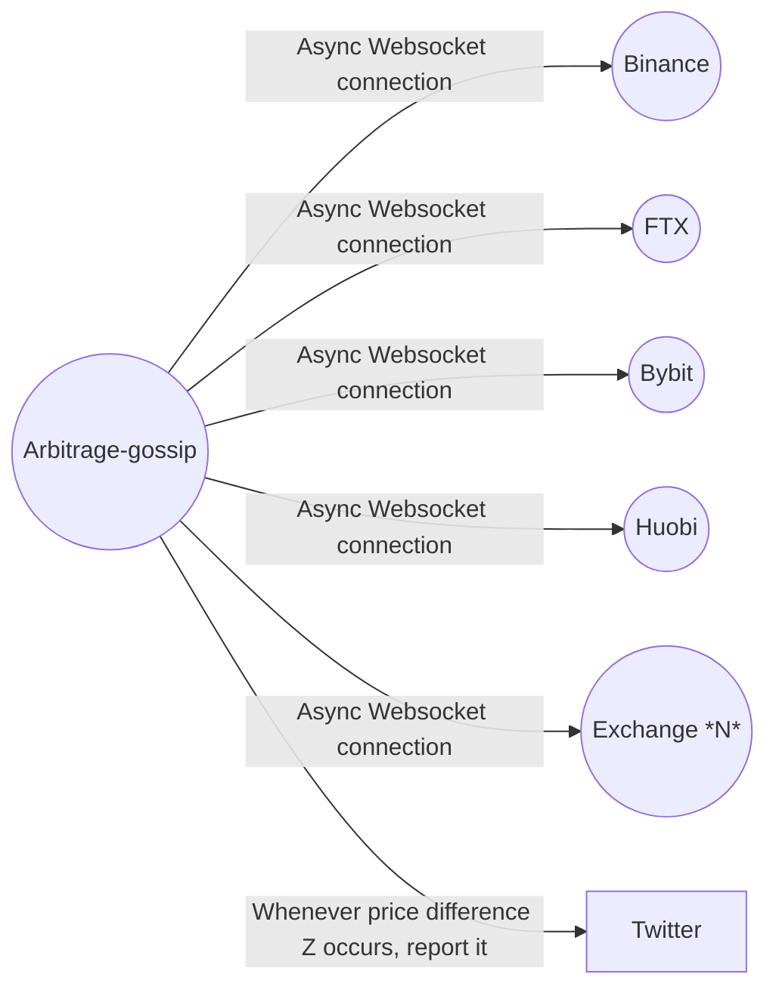

[](https://github.com/psf/black) [](https://www.python.org/downloads/release/python-390/) 

## <p align="center"> Arbitrage-gossip </p>
<p align="center">
Monitor cryptocurrency exchanges and alert on different platforms whenever a  price discrepancy occurs.
</p>

#### Monitored exchanges:
* Binance
* FTX
* ByBit
* Huobi
#### Supported platforms for sending notification:
* Twitter
##
### Implemented Example
https://twitter.com/voices89394387
##
### Table of contents
1)[What's that and how does it work?](#Explained)  
2)[Can i run one myself?](#Run)  
3)[Examples](#Examples)  
4)[Troubleshooting](#Troubleshooting)  


## Explained
That's a bot that asynchronously fetches information from 4(for now) centralized cryptocurrency exchanges and reports it to twitter, given that you have api access, else it only logs the information in the server.


##
## Run
Sure.
Clone the repository
```bash
git clone https://github.com/lbkolev/arbitrage-gossip
cd arbitrage-gossip
```

Setup a virtual environment and activate it. 
```bash
$ python -m venv .venv && . .venv/bin/activate
```

Install all the necessary packages.
```bash
pip install -r requirements.txt
```

If you intend to report the information to twitter, put your api keys in **.env** file in the program's root directory, as shown in **.env-sample**.
##
Check the possible program parameters:
```
$ python arbitrage-gossip/main.py --help
usage: Arbitrage Gossiper - v1.0 Alpha [-h] -b BASE -q QUOTE [-t THRESHOLD] [--log-level {debug,info,warning,error}] [--log-dir LOG_DIR] [--log-file LOG_FILE]
                                       [--report-to REPORT_TO] [--cooldown COOLDOWN]

optional arguments:
  -h, --help            show this help message and exit
  -b BASE, --base BASE  Base asset. ETHUSDT, ETH is base asset
  -q QUOTE, --quote QUOTE
                        Quote asset. ETHUSDT, USDT is quote asset
  -t THRESHOLD, --threshold THRESHOLD
                        The threshold specifies the discrepancy in percentage, after which the information will be reported to --report-to platforms. Defaults to
                        1 percent.
  --log-level {debug,info,warning,error}
                        Logging level. Defaults to info
  --log-dir LOG_DIR     Log directory. Defaults to /var/log/arbitrager/
  --log-file LOG_FILE   Specify a filename to log into. Defaults to {pair}.log
  --report-to REPORT_TO
                        Comma separated list of the platforms we'll notify. **For now only twitter is supported**.
  --cooldown COOLDOWN   Report to the platforms every cooldown seconds. Defaults to 60 seconds
```


## Examples

1. Monitor pair *BTCUSDT* on each exchange that offers it, and report to twitter whenever a price difference of 1% occurs between any of the exchanges. Reports no more often than 180 seconds. 
The information is logged by default to /var/log/arbitrager/btcusdt.log.
```bash
$ python arbitrage-gossip/main.py --base btc --quote usdt --report-to=twitter --cooldown=180 --threshold=1
```
##
2. Monitor pair *LUNAUSDT* on each exchange that offers it, and report to twitter whenever a price difference of 0.3% occurs between any of the exchanges. Reports no more often than 60 seconds. 
The information is logged by default to /var/log/arbitrager/lunausdt.log
```bash
$ python arbitrage-gossip/main.py --base luna --quote usdt --report-to=twitter --cooldown=60 --threshold=0.3
```
##
3. Monitor pair *DOGEBUSD* on each exchange that offers it and log everything that happens into /tmp/dogebusd.log (Should be careful with storage, since debug logging outputs a lot of information). Doesn't report to twitter.
```bash
$ python arbitrage-gossip/main.py --base doge --quote busd --log-dir=/tmp --log-level=debug
```
##
4. Monitor pair *CAKEDAI* on each exchange that offers it, and report to twitter whenever a price difference of 3% occurs between any of the exchanges. Reports no more often than 10 seconds.
The information is logged in /root/cake.log, as specified by --log-file.
```bash
$ python arbitrage-gossip/main.py --base cake --quote dai --log-level=error --log-file=/root/cake.log --report-to=twitter --threshold=3 --cooldown=10 
```
## Troubleshooting
The program supports 4 levels of logging, in ascending order - *debug*, *info*, *warning* and *error*, as per the python's [logging library](https://docs.python.org/3/library/logging.html).  
Use debug if you want to drown in information.  
Info is the default level, outputs everything necessary(recommended).  
Warning and Error log only warnings and errors respectively :).  
Generally everything important should be logged, so that reading the log should generally help you resolve any troubles.
